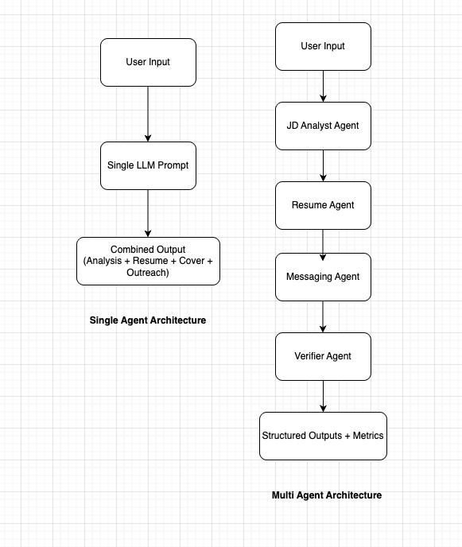

# AI Job Hunt Assistant (Multi-Agent System)

A multi-agent job application assistant built with **CrewAI**, **Python**, and **Streamlit**.

It searches live listings from the **USAJobs API**, then runs a 3-agent workflow to:
1) analyze the job description,
2) generate a tailored resume summary + cover letter,
3) draft a short outreach message for LinkedIn/email,

and logs/saves artifacts locally.

## Features
- USAJobs API search + multi-job selection (Streamlit checkboxes)
- 3-agent CrewAI workflow:
  - JD Analyst → `data/report.md`
  - Resume/Cover Letter Agent → `data/resume_agent_output.txt`
  - Messaging Agent → `data/outreach_message.txt`
- Persistent tracking:
  - `data/applications_log.csv`
  - timestamped cover letters in `data/cover_letters/`

## Tech Stack
Python • CrewAI • Streamlit • USAJobs API • Groq (OpenAI-compatible endpoint)

## Setup
```bash
git clone https://github.com/<your-username>/job_hunt_assistant.git
cd job_hunt_assistant
python3 -m venv .venv
source .venv/bin/activate
pip install -r requirements.txt

## Architecture

<p align="center">
  
</p>
